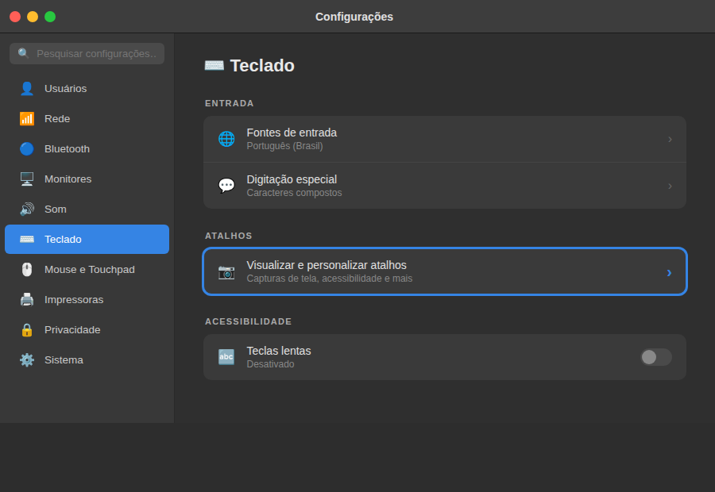
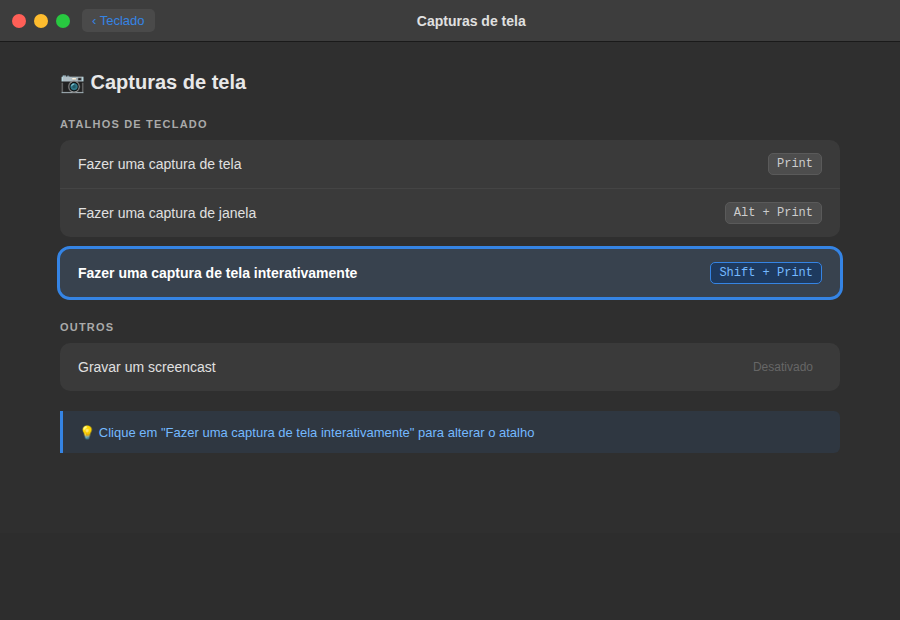
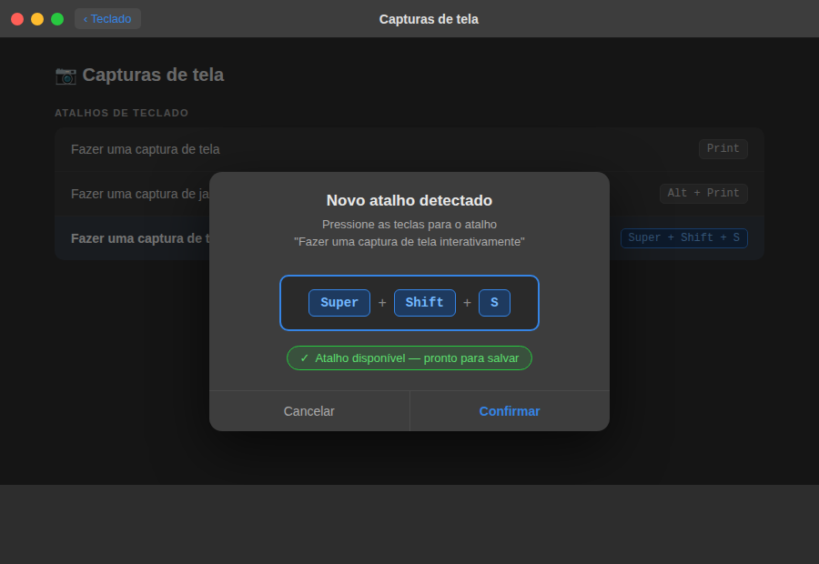
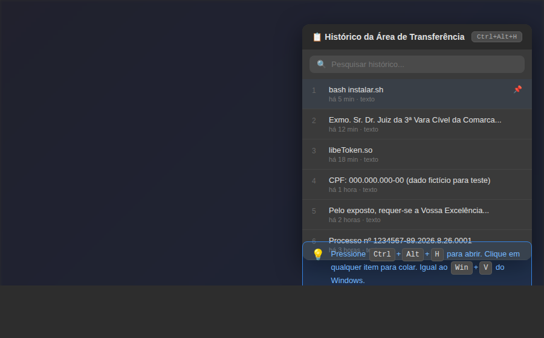
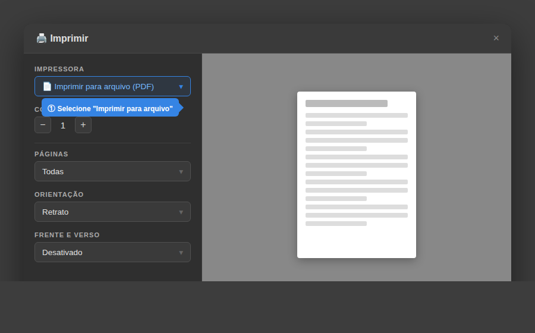
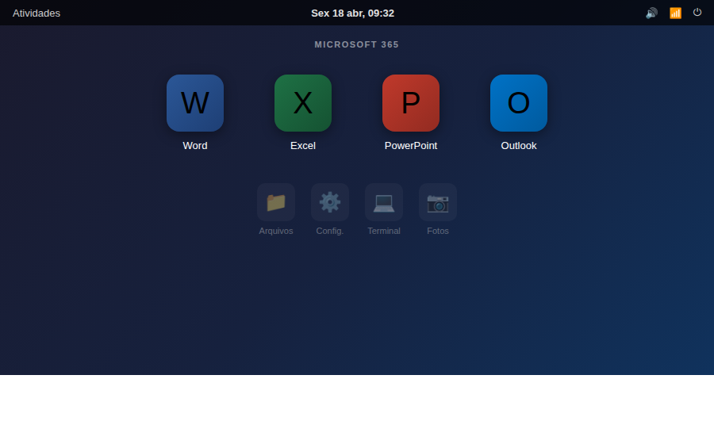

# Dicas para Advogados — Linux como o Windows

Guia rápido de equivalências para quem migrou do Windows para Linux (Ubuntu, Zorin OS, Linux Mint).

---

## 📸 Captura de Tela de Área — equivalente ao Win+Shift+S

No Windows você usa **Win + Shift + S** para selecionar uma área da tela e copiar para a área de transferência.

**No Linux, o atalho equivalente é: `Super + Shift + S`**

O instalador já configura isso automaticamente. Se precisar configurar manualmente:

### Passo a passo manual

**1.** Abra **Configurações do Sistema**

**2.** Clique em **Teclado**



**3.** Role até o final e clique em **Visualizar e personalizar atalhos**

**4.** Na lista, clique em **Capturas de tela**



**5.** Clique em **"Fazer uma captura de tela interativamente"**

**6.** Pressione as teclas `Super + Shift + S` (Super = tecla com logo do Windows/Linux)

**7.** Clique em **Confirmar**



### Como usar

Após configurado (pelo instalador ou manualmente):

1. Pressione **Super + Shift + S**
2. O cursor vira uma mira — **clique e arraste** para selecionar a área
3. A captura é salva em `~/Imagens/` e copiada para a área de transferência
4. Cole em qualquer lugar com **Ctrl+V**

---

## ⌨️ Outros atalhos úteis — Windows → Linux

| Função | Windows | Linux (GNOME) |
|--------|---------|---------------|
| Captura de área | Win+Shift+S | **Super+Shift+S** |
| Captura tela inteira | Print Screen | Print Screen |
| Captura de janela | Alt+Print Screen | Alt+Print Screen |
| Explorador de arquivos | Win+E | Super+E ou Nautilus |
| Gerenciador de tarefas | Ctrl+Shift+Esc | Ctrl+Alt+Delete |
| Pesquisar | Win | Super (abre busca) |
| Minimizar todas janelas | Win+D | Super+D |
| Bloquear tela | Win+L | Super+L |
| Copiar | Ctrl+C | Ctrl+C |
| Colar | Ctrl+V | Ctrl+V |
| Desfazer | Ctrl+Z | Ctrl+Z |

---

## 📋 Área de Transferência com histórico

Diferente do Windows, o Linux não tem histórico de clipboard nativo. Para ter essa funcionalidade (igual ao Win+V do Windows 10/11):

```bash
# Instalar o Clipboard Manager Gnome
sudo apt-get install -y gpaste
```

Depois de instalar: **Super → pesquise "GPaste"** → ative a extensão.

Com ele ativo, pressione **Ctrl+Alt+H** para ver o histórico de itens copiados:



---

## 🖨️ Imprimir para PDF

No Linux, qualquer impressora tem a opção **"Imprimir para arquivo (PDF)"** já instalada. Não precisa de software adicional.

1. **Ctrl+P** em qualquer documento
2. Em **Impressora**, selecione **"Imprimir para arquivo (PDF)"**
3. Escolha a pasta de destino e clique em **Imprimir**



---

## 🔤 Caracteres especiais — acentos e ç

O teclado já está configurado para **Português (Brasil)**. Todos os acentos funcionam normalmente.

Para caracteres especiais não presentes no teclado (ex: `©`, `®`, `™`, `°`):

- Pressione e **segure** a tecla do caractere base por um instante para ver variantes, ou
- Use o aplicativo **"Mapa de caracteres"**: Super → pesquise "Caracteres"

---

## 💾 Recuperar arquivo deletado

No Linux, arquivos deletados vão para a **Lixeira** (como no Windows).

- Abra o **Gerenciador de Arquivos** → **Lixeira** (menu lateral)
- Clique com botão direito no arquivo → **Restaurar**

Se esvaziou a lixeira: use **Ctrl+Z** imediatamente após o delete se ainda estiver na mesma sessão do gerenciador de arquivos.

---

## 💼 Microsoft 365 no Linux

O instalador configura Word, Excel, PowerPoint e Outlook como aplicativos no Linux — sem precisar de Windows, sem emulador, sem complicação. Eles ficam disponíveis no menu de aplicativos como qualquer outro programa:



Clique no ícone e o aplicativo abre direto no navegador como se fosse um programa nativo.

---

## 🔒 Sobre o Token Digital (A3)

Após instalar os drivers com o `instalar.sh`:

1. **Conecte o token** antes de abrir o navegador
2. Acesse o **PJe** normalmente pelo Chrome ou Firefox
3. Na primeira vez, o navegador pedirá para instalar a extensão do **Web Signer** — aceite
4. Para verificar se o driver está funcionando: abra o **SafeNet Authentication Client** (menu de aplicativos) — seu token deve aparecer listado

---

*Dúvidas ou problemas? Consulte o log de instalação em `~/pje-install-*.log`*
