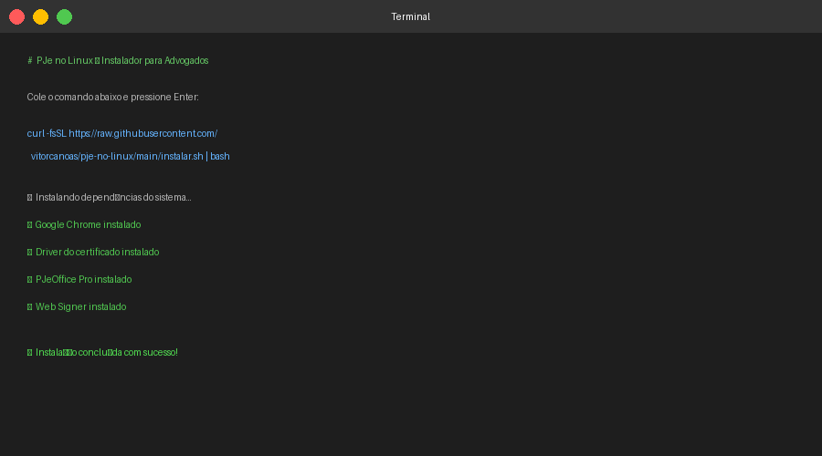
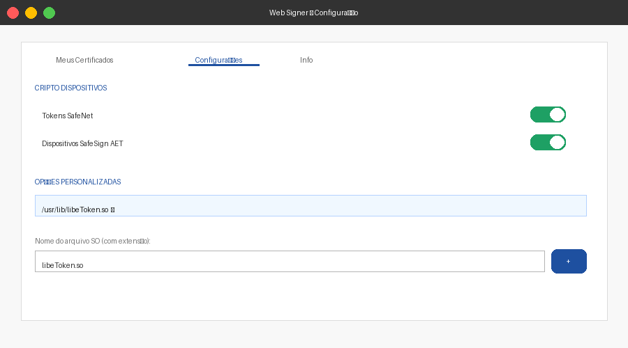
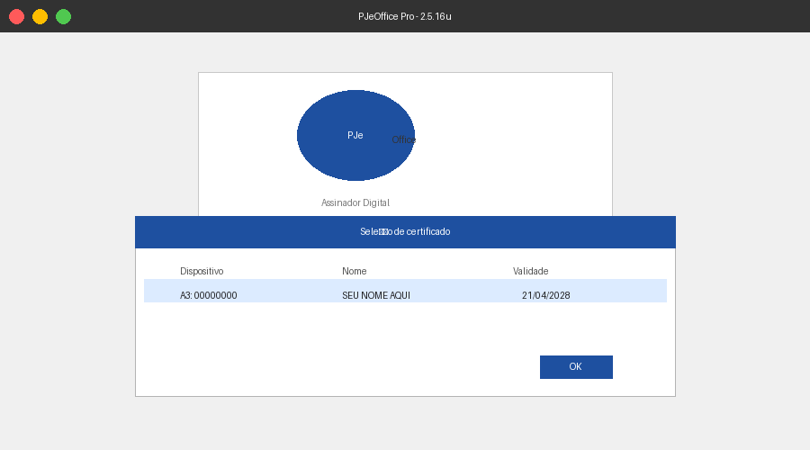
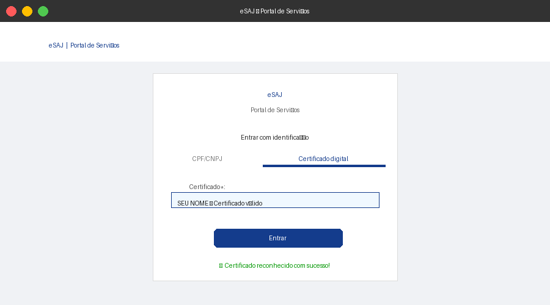

# PJe no Linux — Para Advogados ⚖️

**Você é advogado, acabou de instalar o Linux e não consegue usar o PJeOffice nem o eSAJ?**
Este repositório resolve tudo isso com **um único comando** — sem precisar entender de tecnologia.

Feito por um advogado, para advogados. Depois de horas de luta, reunimos aqui tudo que você precisa.

---

## O que isso instala?

Rodando **um único comando** no terminal, você terá:

| O que | Para que serve |
|---|---|
| **Google Chrome** | Navegador necessário para o eSAJ e outros sistemas judiciais |
| **PJeOffice Pro** | Assinador digital dos tribunais (CNJ) |
| **Driver do token** | Para o computador reconhecer seu certificado A3 (pendrive do certificado) |
| **Web Signer** | Plugin para assinar documentos no eSAJ/TJSP e outros tribunais SAJ |

---

## Como instalar — 3 passos simples

### Passo 1 — Abrir o Terminal

No Linux, o "Terminal" é equivalente ao Prompt de Comando do Windows. Para abrir:

- Pressione as teclas **Ctrl + Alt + T** ao mesmo tempo
- Ou procure por "Terminal" no menu de aplicativos

### Passo 2 — Colar e rodar o comando

Copie o comando abaixo, cole no terminal com **Ctrl + Shift + V** e pressione **Enter**:

```bash
curl -fsSL https://raw.githubusercontent.com/vitorcanoas/pje-no-linux/main/instalar.sh | bash
```



> Quando pedir senha, as letras não aparecem na tela — isso é normal, é uma proteção do sistema.

### Passo 3 — Aguardar

O processo leva alguns minutos. Quando terminar, aparecerá uma mensagem de sucesso.

---

## Após a instalação — configurar o Web Signer para o eSAJ

Esta configuração é feita **uma única vez** no navegador:

1. Abra o **Google Chrome** (instalado pelo script)
2. Instale a extensão **Web Signer** na Chrome Web Store:
   **[Clique aqui para instalar a extensão Web Signer](https://chromewebstore.google.com/detail/web-signer/bbafmabaelnnkondpfpjmdklbmfnbmol)**
3. Clique no ícone do **Web Signer** na barra do Chrome (escudo azul)
4. Vá em **Configurações** (ícone de engrenagem ⚙️)
5. Clique na aba **"Cripto Dispositivos"**
6. No campo **"Nome do arquivo SO"**, digite exatamente: `libeToken.so`
7. Clique no botão **+**



---

## Como fica quando tudo está funcionando

**PJeOffice — token reconhecido:**



**eSAJ — certificado disponível:**



---

## Meu token funciona com este script?

| Como é o token | Nome | Funciona? |
|---|---|---|
| Pendrive branco/cinza com logo Certisign | eToken 5100 ou 5110 | ✅ Sim |
| Pendrive preto dobrado com logo Certisign | GD StarSign | ✅ Sim |
| Pendrive azul com logo SafeNet | eToken PRO | ✅ Sim |
| Cartão azul ou prata com logo GD | Cartão GD | ✅ Sim |
| Cartão azul ou prata com logo SafeNet | Cartão SafeNet | ✅ Sim |
| Arquivo .pfx salvo no computador | Certificado A1 | ✅ Sim |

> **Não sabe qual é o seu?** Olhe o token físico — o fabricante está impresso nele.

**Usa Gemalto, cartão OT/IDE, Cartão CFM ou outro token menos comum?**
Rode também o comando de drivers extras:

```bash
curl -fsSL https://raw.githubusercontent.com/vitorcanoas/pje-no-linux/main/instalar-extras.sh | bash
```

Veja o [guia completo de tokens](docs/tokens.md) para identificar o seu.

---

## Sistemas operacionais compatíveis

| Sistema | Versão | Testado |
|---|---|---|
| Zorin OS | 17 e 18 | ✅ |
| Ubuntu | 22.04 e 24.04 | ✅ |
| Linux Mint | 21 e 22 | ✅ |

---

## Dúvidas frequentes

**"O PJeOffice abriu mas a lista de certificados está vazia"**
→ Verifique se o token está bem encaixado na porta USB. Tente em outra porta. Desconecte e reconecte.

**"O certificado aparece em vermelho"**
→ Certificado vencido. Selecione o que está em preto — é o válido.

**"O site do tribunal diz que o PJeOffice não está instalado"**
→ Abra o PJeOffice primeiro (ícone na área de trabalho), espere carregar, depois acesse o site.

**"Esqueci o PIN do token"**
→ Entre em contato com o emissor do seu certificado (Certisign, OAB, Serasa, etc.).

**"Instalei mas não funcionou"**
→ Abra uma [dúvida aqui](https://github.com/vitorcanoas/pje-no-linux/issues) informando seu sistema operacional e o modelo do token.

---

## Precisa reinstalar? (ex: formatou o computador)

Basta rodar o mesmo comando novamente — ele detecta o que já está instalado:

```bash
curl -fsSL https://raw.githubusercontent.com/vitorcanoas/pje-no-linux/main/instalar.sh | bash
```

---

## Quer contribuir?

Se este guia te ajudou, ajude outros colegas:
- Compartilhe com sua OAB seccional
- Abra um [Pull Request](https://github.com/vitorcanoas/pje-no-linux/pulls) com melhorias
- Reporte problemas em [Issues](https://github.com/vitorcanoas/pje-no-linux/issues)

---

*Feito com ☕ e muita paciência por [Vitor Canoas](https://github.com/vitorcanoas) — advogado que migrou para o Linux e sobreviveu para contar a história.*
