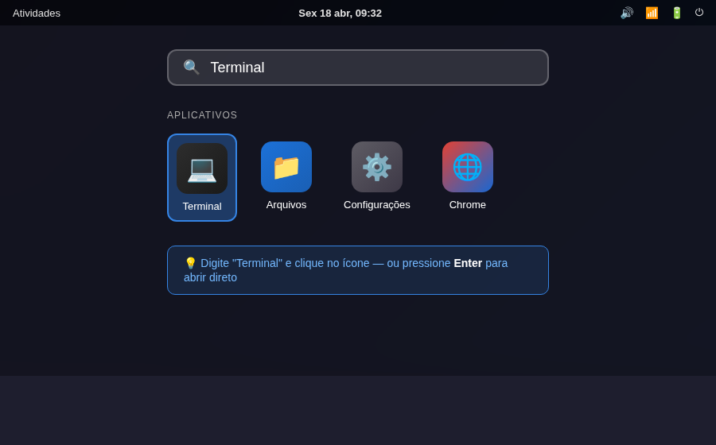
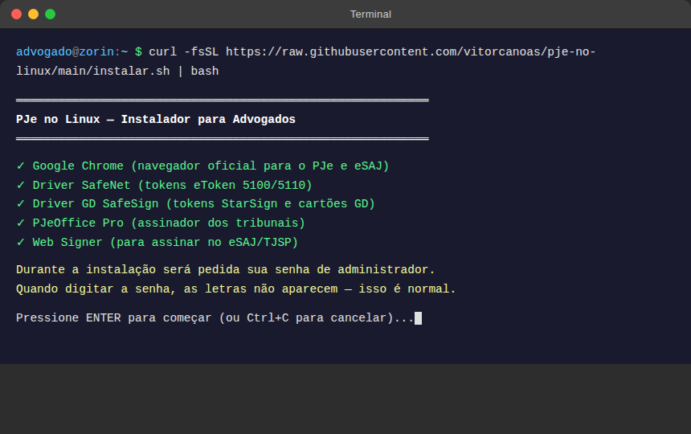
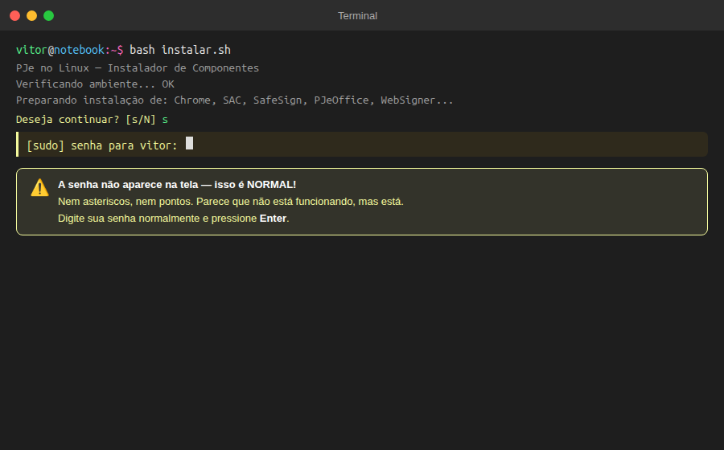
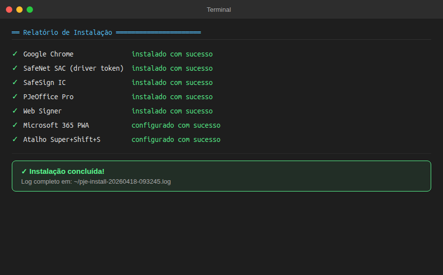
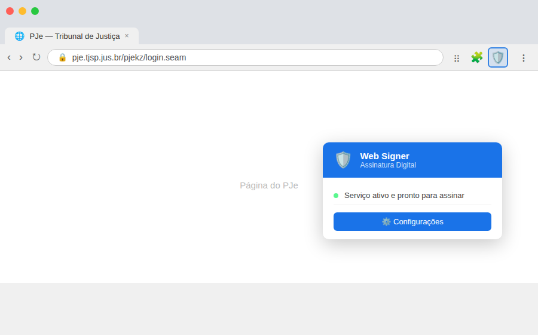
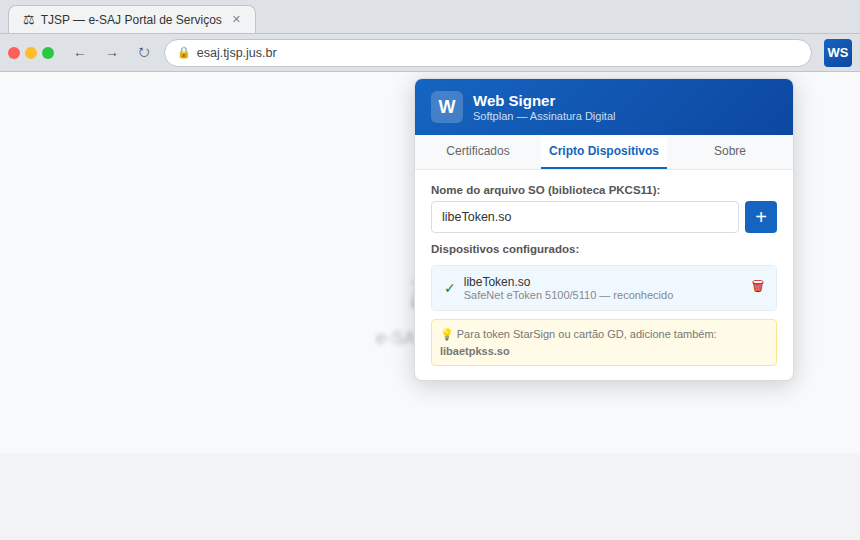
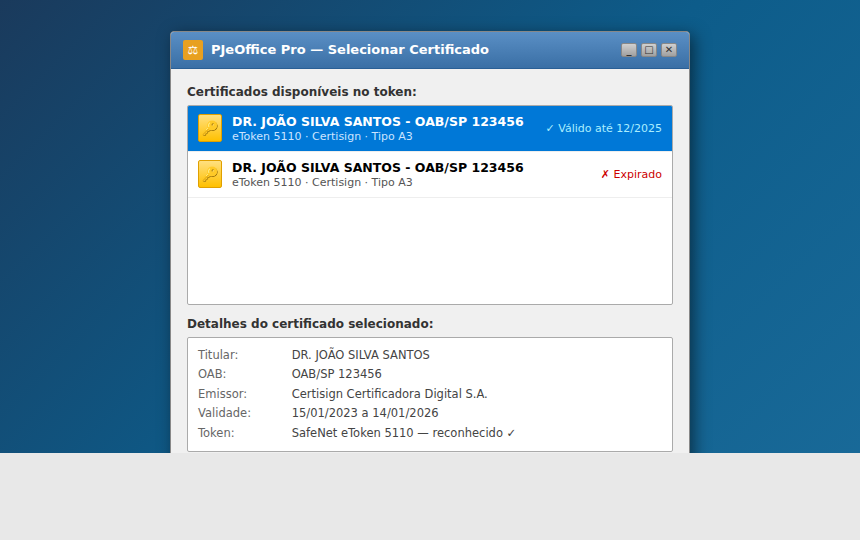
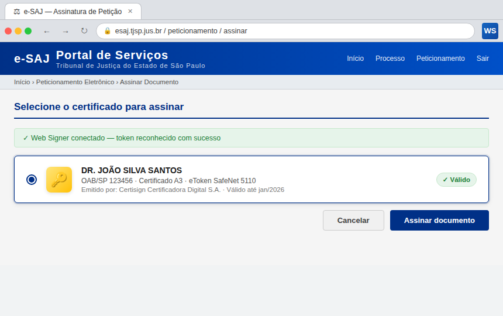

# PJe no Linux

> README em inglês: [README.en.md](README.en.md)

---

## Você acabou de instalar o Linux e não consegue usar o PJe?

Relaxa. Esse guia foi feito **por um advogado, para advogados** — inclusive para quem nunca tocou em Linux na vida.

Aqui você instala tudo que precisa com **um único comando**. Sem precisar entender de tecnologia.

---

## O que esse script instala para você

| O que | Para que serve |
|---|---|
| **Google Chrome** | Navegador oficial do PJe |
| **SafeNet SAC** | Para o computador reconhecer seu token (aquele pendrive do certificado) |
| **SafeSign IC** | Para assinar documentos com seu certificado A3 |
| **PJeOffice Pro** | O assinador digital oficial dos tribunais |
| **Web Signer** | Extensão para assinar no navegador (eSAJ, TJSP e outros) |
| **Antigravity IDE** | Ambiente de trabalho recomendado |
| **Microsoft 365** | Word, Excel, PowerPoint e Outlook funcionando no Linux |

E ainda configura o atalho **Super+Shift+S** para captura de tela — igual ao Win+Shift+S que você usava no Windows.

---

## Como instalar — do zero, passo a passo

### Passo 1 — Abrir o Terminal

**O Terminal é o "Prompt de Comando" do Linux.** É uma janela onde você digita instruções para o computador — parece assustador, mas você vai usar só um comando.

Para abrir:
- Pressione **Ctrl + Alt + T** ao mesmo tempo
- Ou clique em **Atividades** (canto superior esquerdo) → digita **"Terminal"** → clica no ícone



Com o Terminal aberto, você verá uma janela preta. É aqui que você vai digitar o comando:



---

### Passo 2 — Digitar o comando

Com o Terminal aberto, **clique uma vez dentro da janela preta** e digite exatamente isso:

```
bash instalar.sh
```

Depois pressione **Enter**.

> **Dica:** Você pode copiar o texto acima e colar no Terminal com **Ctrl + Shift + V** (no Linux é Shift+V, não só V).

---

### Passo 3 — Digitar sua senha

O instalador vai pedir sua senha de usuário (a mesma que você usa para entrar no computador).

**⚠️ Importante:** Quando você digitar a senha, **as letras NÃO aparecem na tela** — nem asteriscos, nada. Parece que não está funcionando, mas está. É uma proteção normal do Linux. Digite a senha e pressione Enter.



---

### Passo 4 — Confirmar a instalação

Vai aparecer um resumo mostrando o que será instalado. Leia e, se estiver de acordo, **pressione a letra `s`** e depois **Enter** para confirmar.

---

### Passo 5 — Aguardar

O instalador vai baixar e instalar tudo sozinho. Dependendo da sua internet, leva de 5 a 15 minutos. Você vai ver textos passando na tela — isso é normal, pode deixar rodar.

No final, aparece um relatório como este — tudo com ✓ verde significa que deu certo:



---

### Passo 6 — Configurar o Web Signer (uma vez só)

Depois de instalar, abra o **Chrome** e faça essa configuração **uma única vez**:

1. Procure o ícone do **Web Signer** na barra do Chrome (um escudo 🛡️ no canto superior direito) e clique nele



2. Clique em **Configurações** (ícone de engrenagem)
3. Clique na aba **"Cripto Dispositivos"**
4. No campo **"Nome do arquivo SO"**, digite: `libeToken.so`
5. Clique no botão **+**



---

## Quando tudo estiver funcionando

**PJeOffice reconhecendo seu token:**



**eSAJ com seu certificado disponível:**



---

## Algo deu errado?

Não entre em pânico. O instalador grava um log completo com tudo que aconteceu em:

```
~/pje-install-DATA-HORA.log
```

Envie esse arquivo para o suporte e ele terá tudo que precisa para te ajudar.

---

## Dicas para o dia a dia no Linux

Consulte o [DICAS.md](DICAS.md) para aprender:

- **Super+Shift+S** — captura de área da tela (igual ao Win+Shift+S)
- Atalhos do teclado equivalentes ao Windows
- Histórico da área de transferência (igual ao Win+V)
- Como imprimir para PDF
- Como recuperar arquivos deletados
- Como usar o token digital

---

## Sobre o autor

Sou **Vitor**, advogado há mais de 10 anos, apaixonado por tecnologia e, atualmente, aprendendo a programar — porque aparentemente advocacia sozinha não é complicado o suficiente.

Migrei para o Linux e passei horas tentando fazer o PJe funcionar. Depois de muito sofrimento (e algumas palavras que não cabem num README), coloquei tudo isso em um script para que nenhum outro advogado precise passar pelo mesmo.

Afinal, **quem nunca apanhou da tecnologia no dia a dia?** 😄

Se eu consegui, você também consegue.

---

## Para o Advogado Curioso (que gosta de tecnologia)

### Estrutura do projeto

```
instalar.sh          # Script principal — instala todos os componentes
desinstalar.sh       # Remove tudo que o instalar.sh instalou
checksums.sha256     # Hashes SHA256 dos binários (para auditoria)
DICAS.md             # Guia de uso para advogados migrando do Windows
assets/
  icons/             # Ícones PNG 128×128 para os PWAs do Microsoft 365
  screenshots/       # Capturas de tela ilustrativas do README
  dicas/             # Imagens do guia DICAS.md
```

### Segurança

Cada binário baixado é verificado com **SHA256** antes de ser instalado. Se o hash não bater, a instalação aborta. Os hashes ficam no bloco `CONFIG` no topo do `instalar.sh` e devem ser atualizados pelo mantenedor ao mudar versões.

```bash
sha256sum nome-do-arquivo.deb
```

### Como desinstalar

```bash
bash desinstalar.sh
```

Remove todos os pacotes, arquivos de configuração, atalhos e reverte o atalho de captura de tela.

### Componentes e versões atuais

| Componente | Versão | Distribuição |
|---|---|---|
| SafeNet SAC | 10.8.1050 | Ubuntu 22.04 |
| SafeSign IC | 4.2.1.0 | Ubuntu 22.04 |
| PJeOffice Pro | v2.5.16u | Linux x64 |
| Web Signer | 2.12.1 | Chrome (64-bit .deb) |

### Requisitos do sistema

- Ubuntu 22.04 / 24.04, Zorin OS 17/18, Linux Mint 21–22, ou Debian 12+
- Arquitetura: `amd64` (64-bit)
- Bash 5.0+
- Conexão com a internet
- `sudo` disponível

### Para desenvolvedores

O projeto usa **SpecKit** como metodologia de especificação. Veja [AGENTS.md](AGENTS.md) para entender o fluxo de comandos e como contribuir com novas funcionalidades.

```bash
# Verificar qualidade do código
shellcheck --severity=warning instalar.sh
shellcheck --severity=warning desinstalar.sh
bash -n instalar.sh
```

---

*Projeto open source. Contribuições são bem-vindas.*
